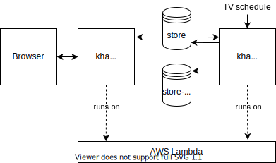
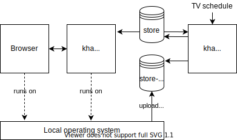

# Kommt heute Aktenzeichen?

## Setting up Kommt heute Aktenzeichen

To set up Kommt heute Aktenzeichen, you need four things:

1. The Python version manager `pyenv`.

2. Python (any version).

3. The Python dependency manager `pipenv`.

4. A set of AWS credentials.

### Installing pyenv

The Python version manager `pyenv` makes sure you can always keep
the exact Python version required by Kommt heute Aktenzeichen,
regardless of your system Python.

To install `pyenv` on Windows, run:

```
python -m pip install pyenv
```

To install `pyenv` on macOS, run:

```
brew install pyenv
```

### Checking your system-wide Python installation

Make sure you have Python (any version) installed on your system.

To check, run:

```
pip --version
```

If that fails, try:

```
pip3 --version
```

Proceed after you’ve confirmed one of those to work.

### Installing pipenv

Install `pipenv` as described under https://pipenv.pypa.io/en/latest/install/#installing-pipenv.

### Installing local dependencies

- Go to the kommtheuteaktenzeichen directory.

- Run the following command:

```
pipenv install -d
```


## Visual Studio Code integration

### Recommended extensions

If you’re using VS Code, we recommend that you install a couple of extensions:

- [Code Runner extension](vscode:extension/formulahendry.code-runner)

- [Draw.io Integration extension](vscode:extension/hediet.vscode-drawio)

- [EditorConfig extension](vscode:extension/EditorConfig.EditorConfig)

- [Prettier extension](vscode:extension/esbenp.prettier-vscode)

- [Python extension](vscode:extension/ms-python.python)

VS Code should automatically remind you to install those when you first open the project.


### Tasks

In VS Code, you may prefer to use the _Run Task_ command instead of the various command lines in this document.


## Running kommtheuteaktenzeichen

### Running the server locally

To launch the web server locally, run:

```
pipenv run server
```

Then point your browser to [http://127.0.0.1:5000/](http://127.0.0.1:5000/).
To do this really quickly, hold down <kbd>⌘</kbd> and double-click the URL that appears on your terminal.

Note: this local server is connected to the development bucket, not the production one.


### Running the CLI version

To do a quick check whether Aktenzeichen runs today, run:

```
pipenv run cli check
```

This will print something like:

> ```
> Kommt heute Aktenzeichen?
> Nein.
> {
>   "verdict": 1,
>   "reference_date": "2021-06-07T21:50:33+02:00",
>   "start_date": "2021-06-09T20:15:00+02:00",
>   "sd_date_published": "2021-06-07T21:50:33+02:00",
>   "runs_today": false,
>   "episode_name": "Folge 567",
>   "episode_number": 567
> }
> ```

Note: the CLI is connected to the development bucket, not the production one.


## Contributing to kommtheuteaktenzeichen

### How kha runs in production



### How kha runs during local development and testing




### Running the tests

To execute the tests, run:

```
pipenv run tests
```

To execute a single test, run e. g.:

```
pipenv run tests -vv tests/test_api.py::test_next_start
```

To execute tests from VS Code, use the test runner built into the Python extension.
You don’t need _Run tasks_ for executing tests.

### Running the linter

To execute the linter, run:

```
pipenv run linter
```

Linting should just work in VS Code. If you want to run the linter manually, run the _Python: Run Linting_ command.

Specifically, you don’t need _Run tasks_ for linting.

### Running the static type check

To execute the static type check, run:

```
pipenv run typecheck
```

### Uploading a local events.kha.json file to the dev bucket

To upload `etc/events.kha.json` to the development bucket, run:

```
pipenv run update-dev-json
```

This allows you to try out a modified JSON file quickly during
development.

### Uploading a local events.kha.json file to the prod bucket

Uploading a local `events.kha.json` file to the production bucket is
usually not necessary. The scheduled scraper should already keep the
file updated.

If you want to upload `events.kha.json` to production anyway,
substitute `PATH_TO_EVENTS_KHA_JSON` in the following command line
with the full path to the file, then run the modified command line.

```
aws --profile=kha-deploy s3 cp PATH_TO_EVENTS_KHA_JSON s3://kha-store/events.kha.json
```

Running that command line will overwrite the existing JSON in
production, and will break the production website if the JSON is
faulty.


## Maintenance

### Refreshing dependencies

If you get errors after a Git pull, refresh your dependencies:

```
pipenv install -d
```

### Checking dependencies for vulnerabilities

To check Kommt heute Aktenzeichen’s dependencies for known vulnerabilities, run:

```
pipenv check
```

### Checking dependencies for compatible updates

To check Kommt heute Aktenzeichen’s dependencies for compatible updates, run:

```
pipenv update --dry-run
```

### Creating an IAM user tied to a project contributor

- In the AWS management console, create a new IAM user (e.g. `annapellegrino`) with both access types _Programmatic access_ and _AWS Management Console access_ and an autogenerated password.

- Assign them to one or both of the `kha-Developers` and `kha-Maintainers` groups.

- Also, assign them to the `SelfAdmin` and `BasicManagementConsoleAccess` group.

- If the contributor should have full administrative access to the entire AWS account (sans managing users), attach the following policies directly to the user:
  - `arn:aws:iam::aws:policy/IAMReadOnlyAccess`
  - `arn:aws:iam::aws:policy/PowerUserAccess`


### Creating IAM credentials with restricted privileges

The purpose of a separate IAM user with restricted privileges is that you can keep a separate AWS profile for it in your `~/.aws/config`, and keep the (less valuable) credentials in clear text in that file.
Developing is easier that way because you need the secure credential process only for deployment, not for running the app locally.

To create a new set of IAM credentials with restricted privileges, follow these steps:

- In the AWS management console, create a new IAM user (e.g. `annapellegrino-kha`) with access type _Programmatic access_.

- Assign them to the `kha-Developers` group.

- Note down the Access Key ID and the Secret Access Key.

- In your `~/.aws/config` file, add two new sections like so:

    ```
    [profile iam-user-kha]
    aws_access_key_id = <access key ID>
    aws_secret_access_key = <secret access key>

    [profile kha-restricted]
    role_arn = <ARN of the `kha-dev-RestrictedAccessRole` role>
    source_profile = iam-user-kha
    ```


### Creating IAM credentials for deployment

To create a new set of IAM credentials for deployment, follow these steps:

- In the AWS management console, create a new IAM user (e.g. `annapellegrino-kha-deploy`) with access type _Programmatic access_.

- Assign them to both the `kha-Developers` and `kha-Maintainers` groups.

- Note down the Access Key ID and the Secret Access Key.

- Set up a secure process to obtain the credentials. For example, see the _Advanced: 1Password integration_ section.

- In your `~/.aws/config` file, add two new sections like so:

    ```
    [profile iam-user-kha-deploy]
    credential_process = <command line to get the security credentials>

    [profile kha]
    role_arn = <ARN of the `kha-prod-DeploymentRole` role>
    source_profile = iam-user-kha-deploy
    ```


## Deployment

To deploy the project to production, run:

```
pipenv run deploy
```

To re-deploy to production, run:

```
pipenv run update
```


## Advanced: Setting up AWS from scratch

Usually you don’t need to do this.

It’s just in case the project needs to be set up from scratch with a brand new AWS account.

Steps to set up AWS from scratch:

- Set up an AWS account and billing. For this example, the account name is `Clackcluster`.

- In the AWS management console, set up multi-factor authentication for the root user.

- Create a personal IAM user which is separate from the root account. For details, see section _Creating an IAM user tied to a project contributor_.

- Install the AWS CLI. To do this on macOS, run:

    ```bash
    brew reinstall awscli
    ```

- In your `~/.aws/config` file, add a new section for the personal IAM user. You can use the `[default]` section for that, or create a dedicated section.

- Set up a secure process to obtain the credentials. For example, see the _Advanced: 1Password integration_ section. This is important because the personal user has deployment privileges (possibly for other projects).

- In your `~/.aws/config` file, add a `credential_process` line to the section. For example:

    ```
    [default]
    credential_process = <command line to get the security credentials>
    ```

- Check connectivity:

    ```bash
    aws iam get-user
    ```

- Set up Zappa for your AWS account:

    ```bash
    pipenv run zappa init
    ```

- Name the environment `prod`.

- Name the private S3 bucket `kha-store`.

- Create a `SelfAdmin` user group:

    ```bash
    aws iam create-group \
      --group-name 'SelfAdmin' \
      --path '/selfadmin/'
    ```

- Create a policy for self-administration:

    ```bash
    aws iam create-policy \
      --policy-name 'SelfAdminPolicy' \
      --description \
        'Grants basic privileges to self-administer one’s own account' \
      --path '/selfadmin/' \
      --policy-document "$(cat 'share/aws.selfadmin-policy.json')"
    ```

- Assign the following policies directly to the `SelfAdmin` group:
  - `SelfAdminPolicy`
  - `arn:aws:iam::aws:policy/IAMSelfManageServiceSpecificCredentials`

- Create a `BasicManagementConsoleAccess` user group:

    ```bash
    aws iam create-group \
      --group-name 'BasicManagementConsoleAccess' \
      --path '/basic/managementconsole/'
    ```

- Assign the `arn:aws:iam::aws:policy/job-function/ViewOnlyAccess` policy directly to the `BasicManagementConsoleAccess` group.

- Create a `kha-Maintainers` user group:

    ```bash
    aws iam create-group \
      --group-name 'kha-Maintainers' \
      --path '/kha/maintainers/'
    ```

- Create a `kha-Developers` user group:

    ```bash
    aws iam create-group \
      --group-name 'kha-Developers' \
      --path '/kha/developers/'
    ```

- Create a policy for deployment to production:

    ```bash
    aws iam create-policy \
      --policy-name 'kha-prod-DeploymentPolicy' \
      --description \
        'Grants all privileges needed to deploy and manage kha' \
      --path '/kha/prod/deploy/' \
      --policy-document "$(cat 'share/aws.deployment-policy.prod.json')"
    ```

- Also create a policy for restricted access to production:

    (Note: The lambda function needs this at runtime.)

    ```bash
    aws iam create-policy \
      --policy-name 'kha-prod-RestrictedAccessPolicy' \
      --description \
        'Grants privileges kha needs at runtime, e.g. S3 access' \
      --path '/kha/prod/restricted/' \
      --policy-document "$(cat 'share/aws.restricted-policy.prod.json')"
    ```

- Finally, create a policy for restricted access to the development bucket:

    (Note: This is required for local development.)

    ```bash
    aws iam create-policy \
      --policy-name 'kha-dev-RestrictedAccessPolicy' \
      --description \
        'Grants privileges for local development, e.g. S3 dev bucket access' \
      --path '/kha/dev/restricted/' \
      --policy-document "$(cat 'share/aws.restricted-policy.dev.json')"
    ```

- In the AWS management console, create three roles:
  - a role named `kha-prod-DeploymentRole` based on your account ID and on the `kha-prod-DeploymentPolicy` policy.
  - a role named `kha-prod-RestrictedAccessRole` based on your account ID and on the `kha-prod-RestrictedAccessPolicy` policy.
  - a role named `kha-dev-RestrictedAccessRole` based on your account ID and on the `kha-dev-RestrictedAccessPolicy` policy.

- Edit the trust relationship of the `kha-prod-RestrictedAccessRole` role to include the following statement:

    (Note: This has been experimentally discovered and, independently, documented in [this blog article](https://silvaneves.org/the-role-defined-for-the-function-cannot-be-assumed-by-lambda.html).)

    ```json
    {
      "Effect": "Allow",
      "Principal": {
        "Service": [
          "apigateway.amazonaws.com",
          "events.amazonaws.com",
          "lambda.amazonaws.com"
        ]
      },
      "Action": "sts:AssumeRole"
    }
    ```


- Edit the `kha-Maintainers` group and grant them the following permissions:
  - `kha-prod-DeploymentPolicy`
  - `kha-prod-RestrictedAccessPolicy`
  - `kha-dev-RestrictedAccessPolicy`

- Edit the `kha-Developers` group and grant them the `kha-dev-RestrictedAccessPolicy` permission.


## Advanced: 1Password integration

If you add 1Password integration, you don’t have to expose your AWS credentials in plain text in a file.

The following steps have been tested on macOS only. The 1Password GUI has some differences among platforms so it’s not guaranteed that
it works on platforms other than macOS.

### Configuring 1Password CLI on macOS

One-time steps to configure 1Password CLI on macOS:

1. Make sure the 1Password CLI is installed and configured for your 1Password vault.

2. Make sure the `jq` utility is installed. To install or update it, run:

    ```bash
    brew reinstall jq
    ```

3. Create a login item in 1Password with two fields named `Access Key ID` and `Secret Access Key`. Fill in your AWS credentials.

4. Create a script named `op-aws-credentials-client` with the following content:

    ```bash
    #!/bin/bash
    if [ "${SKIP_AWS_SECRET:-0}" -ne '0' ]; then
      printf '\0'
      exit 0
    fi
    op get item \
      --fields='Access Key ID,Secret Access Key' \
      --vault=<your_vault_id_here> \
      <your_item_id_here> \
      | jq "$(cat << EOF
        {
          Version: 1,
          AccessKeyId: ."Access Key ID",
          SecretAccessKey: ."Secret Access Key",
        }
    EOF
        )"
    ```

5. In the 1Password for Mac GUI app, open the preferences and go to the _Advanced_ tab (it’s the rightmost one). Tick the checkboxes that enable UUID and JSON copying.

6. Replace the fragments `<your_vault_id_here>` and `<your_item_id_here>` with the actual vault UUID and login item UUID. To obtain those UUIDs, consult the context menu of your login item.

7. Create a file `config` in your `~/.aws` directory if it’s not already there.

8. Edit your `~/.aws/config` as follows:

    ```
    [default]
    credential_process = /path/to/op-aws-credentials-client
    ```

9. Replace the fragment `/path/to/op-aws-credentials-client` with the actual path to your `op-aws-credentials-client` script.


## Acknowledgements

This website uses the Economica font by [Vicente Lamonaca](https://lamonaca.org/). The font is licensed under the [SIL Open Font License, 1.1](http://scripts.sil.org/OFL).

Favicons are generated by [favicon.io](https://favicon.io).


## License

Copyright (c) 2021 The kommtheuteaktenzeichen authors

Licensed under the Apache License, Version 2.0 (the "License");
you may not use this file except in compliance with the License.
For a copy of the License, see [LICENSE](LICENSE).
